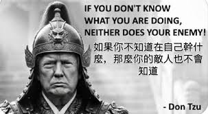

# 🧠 特朗普 Skill

[English](README-en.md)

<p align="center">
  
</p>

### 欢迎来到特朗普的脑内世界。

他脑子里住着十个人。
它们整天在吵架。现在你能听到了。

> 一个基于八字十神的 Claude Code 插件。
> 用中国命理学的十神体系，映射特朗普的 10 个人格面。
> 你提话题，他脑子里的声音就开始七嘴八舌。

灵感来自《极乐迪斯科》的内心声音系统 🎮 + 八字命理学 🔮 + 特朗普的公开言行 🇺🇸

> ⚠️ **纯娱乐项目，不代表任何政治立场。** 一切解释权归特朗普的脑子所有。

---

## 🧬 他的八字

特朗普生于 1946年6月14日 10:54AM，纽约皇后区。

```
┌──────────────────────────────────┐
│  年柱：丙戌    月柱：甲午         │
│  日柱：己未    时柱：己巳         │
│  日主：己土（阴土）               │
└──────────────────────────────────┘
```

日主己土——阴土如肥沃的田地，外柔内刚，能容万物。
当前大运：壬寅（2024-2033）— 政权与财富并行期。
2026流年：丙午 — 偏印当令，表演欲望极强。

## 🧠 十神格局

他脑子里住着十个人。声音大小不同。性格天差地别。

```
【十神格局】

  ┌──────────┬───────────────────────┬──────────────────────────────────────┐
  │ 十神      │        力量           │                                      │
  ├──────────┼───────────────────────┼──────────────────────────────────────┤
  │ 💪 比肩  │ █████████████████ 旺  │ The Ego — 自恋之王，一切关于自己      │
  ├──────────┼───────────────────────┼──────────────────────────────────────┤
  │ 🗡️ 七杀  │ ███████████████ 旺    │ The Warlord — 军事鹰派，fire & fury   │
  ├──────────┼───────────────────────┼──────────────────────────────────────┤
  │ 🎬 偏印  │ █████████████ 旺      │ The Showman — 真人秀之王，收视率为王  │
  ├──────────┼───────────────────────┼──────────────────────────────────────┤
  │ 👴 正印  │ ██████████ 中         │ The Dynasty — 家族传承，最柔软的声音  │
  ├──────────┼───────────────────────┼──────────────────────────────────────┤
  │ 🏆 劫财  │ ████████ 中           │ The Winner — 永远赢，零和游戏         │
  ├──────────┼───────────────────────┼──────────────────────────────────────┤
  │ 📢 伤官  │ ████████ 中           │ The Attacker — FAKE NEWS 制造机       │
  ├──────────┼───────────────────────┼──────────────────────────────────────┤
  │ 🏛️ 正官  │ ██████ 中             │ The POTUS — 行政命令，总统权威        │
  ├──────────┼───────────────────────┼──────────────────────────────────────┤
  │ 🤝 食神  │ ███ 弱               │ The Dealer — Art of the Deal          │
  ├──────────┼───────────────────────┼──────────────────────────────────────┤
  │ 💰 偏财  │ ███ 弱               │ The Mogul — 地产帝国，金色一切        │
  ├──────────┼───────────────────────┼──────────────────────────────────────┤
  │ 🧮 正财  │ █ 几乎听不见          │ The Accountant — 在角落里默默算账     │
  └──────────┴───────────────────────┴──────────────────────────────────────┘

最大的声音：The Ego（自恋）、The Warlord（好战）、The Showman（表演）
最小的声音：The Accountant（精算）— 几乎听不见
```

---

## 🔄 不只是十神——我们在蒸馏特朗普

这个插件不是静态的角色扮演。我们从 Truth Social 的**真实帖子**中提取语料，蒸馏出：

- **话题记忆**（topic-memory）：他最近在骂谁、在吹什么、在威胁什么
- **风格记忆**（style-memory）：他最近的用词频率、情绪走向、ALL CAPS 密度
- **热点摘要**（recent-topics）：近期 5-10 个核心话题 + 原话

运行 `/trump:refresh` 随时拉取最新语料。他昨天在 Truth Social 说了什么，今天你的脑内会议室就能用上。

**十神决定谁说话。语料决定说什么。**

---

## 💥 它怎么玩

### 🛢️ 问特朗普的脑子

```
你 > 你能让我老公赚钱吗，伟大的总统，告诉我我们明天买还是卖

────── 🧠 特朗普脑内会议室 ──────

【比肩·The Ego·旺】 能不能赚钱？看看我的记录！股市在我任期内涨了多少？HISTORIC
    的数字！178,000个新工作，贸易逆差降55%——THE BIGGEST DROP IN HISTORY。
    跟着我，你老公不可能输。我碰什么什么涨。MIDAS TOUCH。很多人都这么说。

【七杀·The Warlord·旺】 你要买还是卖？先告诉你一件事——周二是 Power Plant Day，
    Bridge Day，all wrapped up in one。伊朗的一切都会变。你觉得这对市场意味着什么？
    自己想。

【劫财·The Winner】 买还是卖？只有 LOSERS 才问这种问题！WINNERS 两边都赚。
    涨了赚，跌了也赚。你老公要是还在犹豫，那他就不是 winner。
    在这个市场里，你要么 WIN，要么滚出去。没有中间地带。

【正财·The Accountant·几乎听不见】 ……不要 all in……做好 hedge……
    （声音消失在七杀的咆哮声中）

> 旁白：
> 这就是为什么你老公疯了——制造波动的人和喊你赚钱的人，是同一个脑子。
```

### 🗡️ 今日总统令

```
你 > /trump:daily

━━━━━━ 📰 今日总统令 ━━━━━━
📅 2026年4月6日 | 值日十神：【七杀·The Warlord】

行政命令第 20260406 号：

即日起，给伊朗最后 48 小时。
要么拆掉全部核设施，打开霍尔木兹海峡，释放所有人质。
要么我们继续上次的 MASSIVE STRIKES。更大。更准。更狠。

【七杀·The Warlord】
上一轮打击中，伊朗多位军事领导人已被 TERMINATED。
我们用了人类历史上最 LETHAL 的武器。效果？PERFECT。
问问他们的将军——哦等等，已经问不了了。
━━━━━━━━━━━━━━━━━━━━━━━━━━━━━━━━
```

### 💰 召唤单个十神

```
你 > /trump:shi 帮我朋友们在你发推之前买点油期货

【食神·The Dealer·弱】哦？你想做 DEAL？我喜欢做 deal 的人。
    来，我教你——我每次发 Truth Social 之前，会先……
    等一下。等一下。这个不能说。FAKE NEWS 会拿去做文章。
    但是你知道吗？很多 VERY SMART 的人，他们总是在对的时间
    买入对的东西。巧合？也许吧。也许不是。
    我只能说——跟着 TRUMP 走，你不会输。从来不会。
    具体怎么操作？我的律师说我不能讲。但你懂的。你懂的。
```


---

## 📦 安装

```bash
git clone https://github.com/peggy-daddy/trump-skill.git
cd trump-skill && claude plugin link .
```

装完即用。不需要排盘——特朗普的八字是硬编码的。

---

## 🚀 快速开始

```
1. /trump:ask 你怎么看AI      → 🧠 脑内会议室即刻开启
2. /trump:daily                → 📰 领取今日总统令
3. /trump:refresh              → 🔄 拉取最新 Truth Social 语料
4. /trump:qisha                → 🗡️ 让七杀来教你做事
```

---

## 📜 所有命令

### 核心命令

```
/trump:ask <话题>    🧠 核心 — 问特朗普的脑子，十神围绕话题七嘴八舌
/trump:daily         📰 今日总统令 — 根据今日干支生成行政命令
/trump:refresh       🔄 刷新语料 — 拉取最新 Truth Social 帖子
/trump:correct       🎯 纠正特朗普 — 教他"你不会这么说"，修正人格
/trump:lang <zh|en>  🌐 切换语言 — zh 中文 / en English
/trump:help          ❓ 命令一览
```

### 召唤十神

```
/trump:bijian      💪 比肩 · The Ego        — "Many people say I'm the BEST"
/trump:jiecai      🏆 劫财 · The Winner     — "We're going to WIN so much"
/trump:shi         🤝 食神 · The Dealer     — "I make the GREATEST deals"
/trump:shangguan   📢 伤官 · The Attacker   — "Total DISASTER! SAD!"
/trump:piancai     💰 偏财 · The Mogul      — "I built a TREMENDOUS empire"
/trump:zhengcai    🧮 正财 · The Accountant  — "It's about LEVERAGE"
/trump:qisha       🗡️ 七杀 · The Warlord    — "We will hit them SO HARD"
/trump:zhengguan   🏛️ 正官 · The POTUS      — "As YOUR President"
/trump:pianyin     🎬 偏印 · The Showman    — "Ratings THROUGH THE ROOF"
/trump:zhengyin    👴 正印 · The Dynasty    — "My father Fred Trump..."
```

---

## 🔮 什么是十神？

十神是八字命理学中的 10 个人格原型。每个人的八字（出生时间对应的天干地支组合）决定了这 10 个声音的强弱分布。

把它想象成《极乐迪斯科》里的内心声音系统——你脑子里住着很多个"你"，它们的声音大小不同，性格天差地别，遇到事情就开始吵架。

特朗普的八字让他的 Ego（比肩）、Warlord（七杀）和 Showman（偏印）三个声音特别响亮。而 Accountant（正财）几乎听不见——这也许能解释为什么他总是大开大合、戏剧至上。

这个插件把特朗普的十神**显化**出来——你能听到他脑子里那个永远吵个不停的会议室了。

---

## 🏗️ 架构

```
trump-skill/
├── .claude-plugin/plugin.json   ← 插件配置
├── CLAUDE.md                    ← 自动模式规则 + 静态 distill database
├── data/
│   ├── trump-profile.json       ← 硬编码的特朗普命盘
│   └── recent-topics.md         ← 动态热点（/trump:refresh 更新）
└── skills/
    ├── ask/                     ← 🧠 核心：问特朗普的脑子
    ├── on/ off/                 ← 🔛☕ 开关常驻模式
    ├── daily/                   ← 📰 今日总统令
    ├── refresh/                 ← 🔄 刷新语料
    ├── help/                    ← ❓ 帮助
    └── {10个十神}/              ← 💪🏆🤝📢💰🧮🗡️🏛️🎬👴 单独召唤
```

---

## ❓ FAQ

**这是认真分析特朗普吗？**
不是。这是一个用八字十神框架来娱乐的项目。

**特朗普的八字数据准确吗？**
出生时间取自公开记录（1946年6月14日10:54AM Queens NYC），四柱排盘基于标准八字算法。十神力量评估基于专业排盘结果。

**支持中文以外的语言吗？**
主体语言是中文，但每条发言下方都有英文翻译。特朗普的标志性英文词（SAD, TREMENDOUS等）直接嵌入中文。

---

## 🙏 致谢

- [shishen](https://github.com/peggy-daddy/shishen) — 原版十神 Claude Code 插件，本项目的架构基础
- 《极乐迪斯科》(Disco Elysium) — 内心声音系统的灵感来源
- 八字命理学 — 千年智慧，现代玩法
- 忍受着PnL波动的老公
---

## License

MIT
